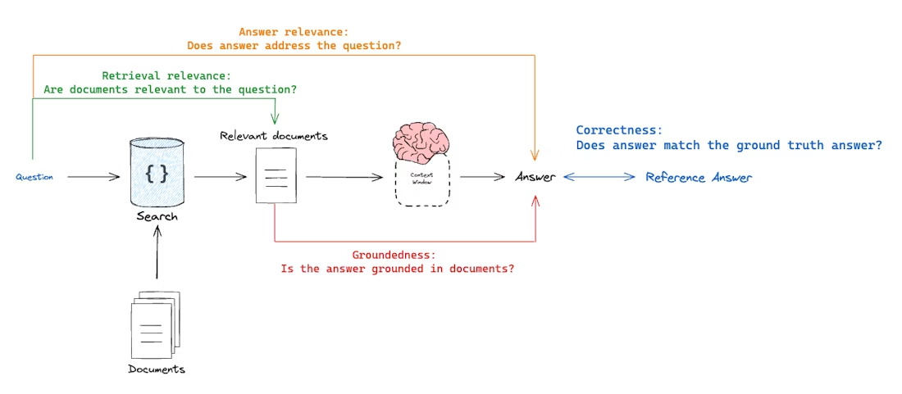

# INTRODUCTION

This is a simple naive retrieval-augmented generation application created to respond to queries about based on facts about cats in a text file. 

## HOW TO RUN THIS PROJECT
1. Clone the repository.
2. Create a new Python environment using `venv`.
3. Activate the new venv environment and install all the requirments from `requirements.txt` using `pip`.
4. Write a new `.env` file and enter data for these variables for a Postgres database connection.
DB_USER=
DB_PASSWORD=
DB_HOST=
DB_PORT=
DB_NAME=
5. Run `python app.py`
6. Run `python rag_testing/testing_main.py` for evaluation.

*Caveats: The project may break in certain places. I haven't written any tests for the program itself yet. There are lots of things to do to build on this (Read Next Steps at the end of this Readme). Feel free clone this project, work on your branch and create pull requests later.*

# PROJECT GOALS
The primary goals for this project is:
1. Build without frameworks to learn the underlying mechanisms behind powering a RAG project. Abstractions will get in the way of my learning now. This will allow me to build a lot of divergent pathways in my brain around RAG.
2. Make the project sufficiently modular so that the fundamental building blocks of the project can be tested in isolation and improved upon.
3. Using as less cloud services as possible to learn how to build RAG apps on a local server. 

# BUILDING BLOCKS OF THE PROJECT
1. Data layer - storing data on cat facts in a local `postgres` database and using `pgvector` as a vector extension in postgres to store vector embeddings
2. Knowledge representation - Indexing fixed-size chunks with a local Ollama embedding model `mxbai-embed-large:latest` and storing the embeddings in postgres
3. Retrieval layer - basic cosine similarity search with top-n ranking
4. Generation layer - generation with a local Ollama embedding model `gemma3:4b` with simple system and user prompts

# PROVENANCE
The previous version of this project had these properties:
1. Data layer - local text file and an in-memory Python tuple to store vector embeddings
2. Knowledge representation - Indexing fixed-size chunks with a local Ollama embedding model `mxbai-embed-large:latest`
3. Retrieval layer - basic cosine similarity search with top-n ranking
4. Generation layer - generation with a local Ollama embedding model `gemma3:4b` with simple system and user prompts

# RAG TESTING FRAMEWORK
## RAG EVALUATION
We can view RAG evaluation as a tuple of "what is being evaluated?" vs "what is it being evaluated against?". There are different dimensions of this evaluation routine.
1. Correctness - Response vs Reference answer (how accurate the response is, agnostic of context)
    - Goal: Measure "how similar/correct is the RAG chain answer relative to a ground-truth answer"
    - Evaluator - LLM-as-judge
2. Relevance - Response vs Input 
    - Goal: Measure "how well does the RAG chain answer address the input question"
    - Evaluator - LLM-as-judge
3. Groundedness - Response vs retrieved docs
    - Goal: Measure "to what extent does the generated response agree with the retrieved context"
    - Evaluator - LLM-as-judge
4. Retrieval Relevance - Retrieved docs vs input
    - Goal: Measure "how relevant are my retrieved docs/results for this query
    - Evaluator - LLM-as-judge

# NEXT STEPS
1. Add more examples to better test the full scope of the application
2. Improve context recall by testing different embedding strategies (maybe make embedding modular so that I can swap in and out different embedding methods and test them in isolation while controlling other variables)
3. Latency measurement (now it takes way too long to generate locally on my machine, want to see if I can bring it down)
3. Throughput measurement (want to measure how many resopnses per unit time this application can handle)
4. Build a custom RAG tests dashboard
5. This application produces inconsistent responses which also contain some hallucinations in the generation phase. I need to have better parameteres for more determinism (ex - lower temperature, fixed seed values, etc). The prompt instruction plays the biggest role in deterministic answers. I need to come up with a super strong template.